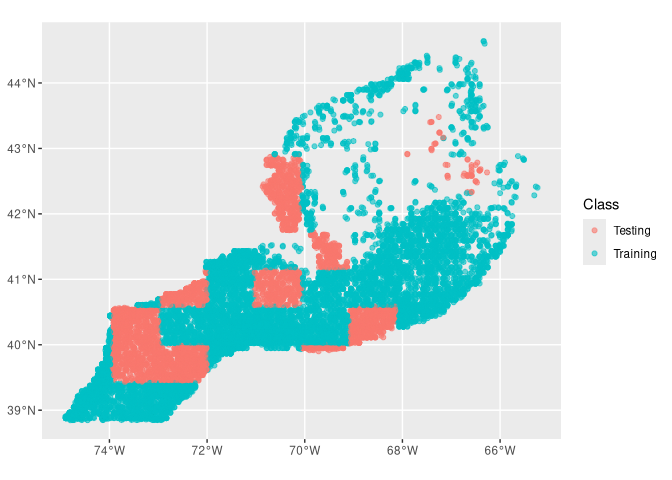
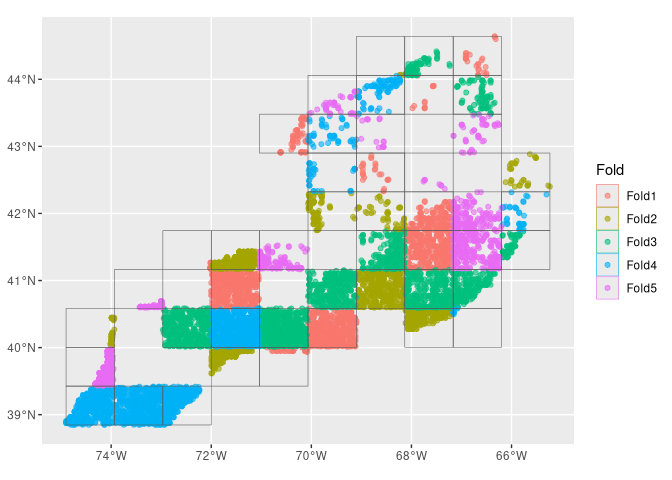
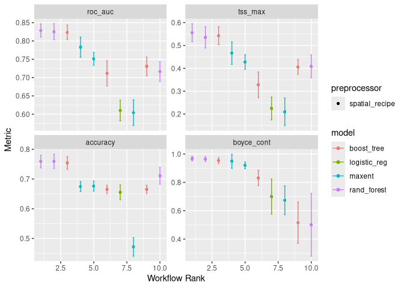
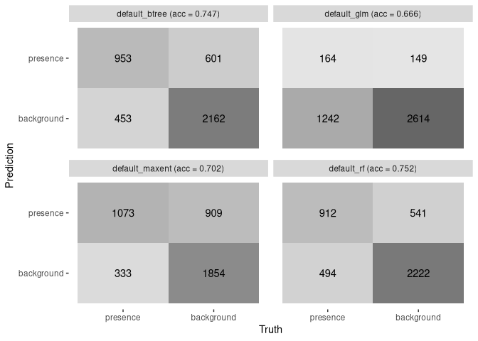
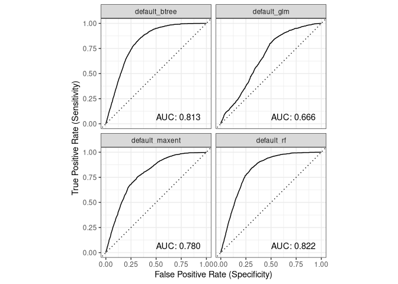
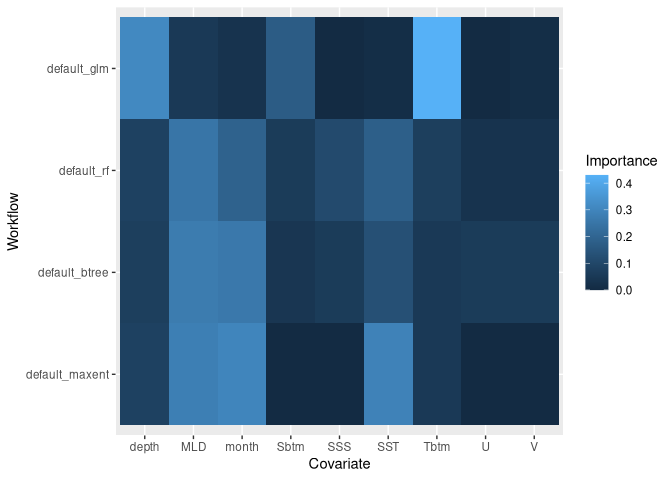
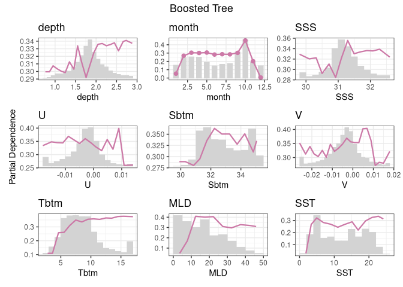
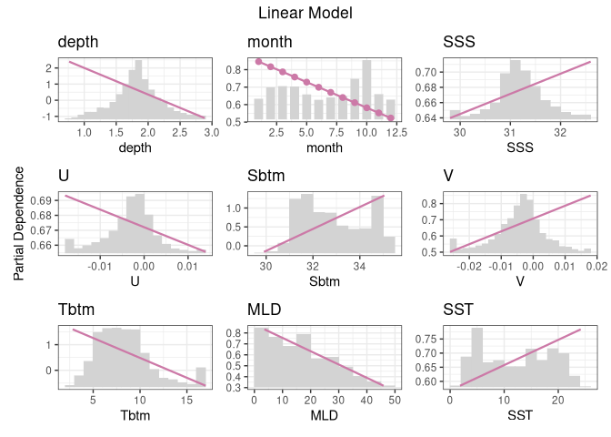
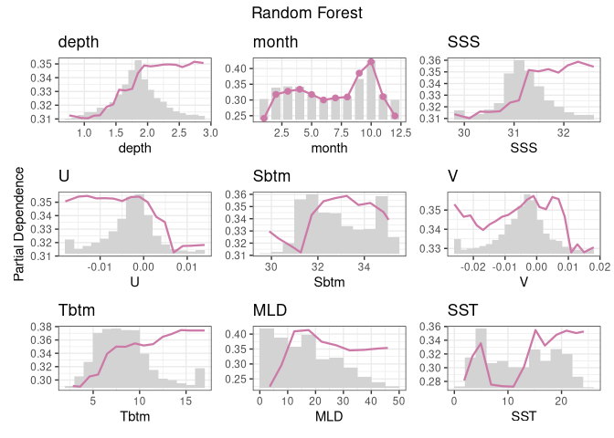
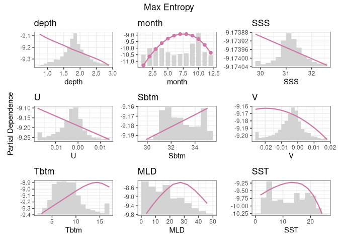

Models for Longfin Inshore Squid
================

###### Zoe Ahmiegbe

### Steps

#### Loading Data

To build a model, I need two things: the configuration file and
covariate data (variables).

#### Splitting the Data

Why do I split the data? So the model doesn’t just memorize what we give
it. It’s important that it’s tested on unseen data. I’ll use 80% of the
data to train the model and will reserve 20% of the data for later
testing.

This plot shows the spatial distribution of the training and testing
data.
<!-- -->

I then divide the training data into spatial cross-validation folds to
help the model learn patterns across different regions.
<!-- -->

#### Building a Recipe

A recipe is the blueprint for the data handling and modeling process.

    ## 

    ## ── Recipe ──────────────────────────────────────────────────────────────────────

    ## 

    ## ── Inputs

    ## Number of variables by role

    ## outcome:   1
    ## predictor: 9
    ## coords:    2

#### Creating a Workflow

My workflow will contain my recipe and a list of desired models. It is
also used for specifying hyperparameters.

    ## # A workflow set/tibble: 4 × 4
    ##   wflow_id       info             option    result    
    ##   <chr>          <list>           <list>    <list>    
    ## 1 default_glm    <tibble [1 × 4]> <opts[0]> <list [0]>
    ## 2 default_rf     <tibble [1 × 4]> <opts[0]> <list [0]>
    ## 3 default_btree  <tibble [1 × 4]> <opts[0]> <list [0]>
    ## 4 default_maxent <tibble [1 × 4]> <opts[0]> <list [0]>

Next, I chose the metrics for evaluating model performance. I used the
default metrics from the tidysdm package (Boyce Index, TSS, and AUC) and
included accuracy to provide an additional measure of performance.

#### Fitting the Models to the Recipes

Firstly, I will find hyperparameters to use for fitting by iterating
over different values for each.

Here’s a quick plot of the outputs, with each metric being showcased.

``` r
autoplot(wflow)
```

<!-- -->

The goal is to choose the best set of hyperparameters for each model.

#### Exploring the Model Fit Results

We can make simple collective representations of the fitted models.

##### A table of metrics

We can quickly pull together summary statistics.

    ## # A tibble: 4 × 5
    ##   wflow_id       accuracy boyce_cont roc_auc tss_max
    ##   <chr>             <dbl>      <dbl>   <dbl>   <dbl>
    ## 1 default_glm       0.666      0.896   0.666   0.312
    ## 2 default_rf        0.752      0.986   0.822   0.534
    ## 3 default_btree     0.747      0.987   0.813   0.511
    ## 4 default_maxent    0.702      0.994   0.780   0.440

##### Confusion matrices and accuracy

We can plot confusion matrices and add accuracy. Accuracy is the
proportion of the data that are predicted correctly.  
<!-- -->

##### ROC/AUC

These are plots of Receiver Operator Curves (ROC) from which the Area
Under the Curve (AUC) is computed. The ROC illustrates the trade-off
between the model’s ability to correctly detect positives versus false
alarms, while the Area Under the Curve (AUC) provides a single score
representing the overall likelihood that the model can successfully
distinguish between the two classes. The higher the AUC, the better.
<!-- -->

My random forest and boosted regression tree models both have scores
above 0.8! That’s pretty exciting.

##### Variable importance

Variable importance can tell us about the contribution each covariate
variable makes toward the whole.

<!-- -->

##### Partial Dependence Plots

To illustrate the relationship between each feature and the model’s
response, I plotted the partial dependence for every variable.

###### Boosted Tree

<!-- -->

###### Generalized Linear Model

<!-- -->

###### Random Forest

<!-- -->

###### Maximum Entropy

<!-- -->

### Conclusion

After loading the data, I set aside a testing group to use only for the
final check. I evaluated the models using standard metrics like accuracy
and AUC, and I used partial dependence plots to visualize the impact of
specific variables.
