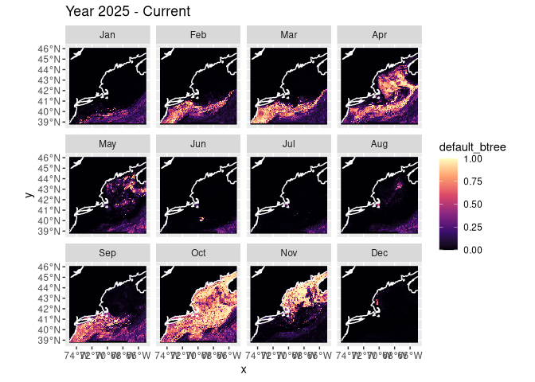
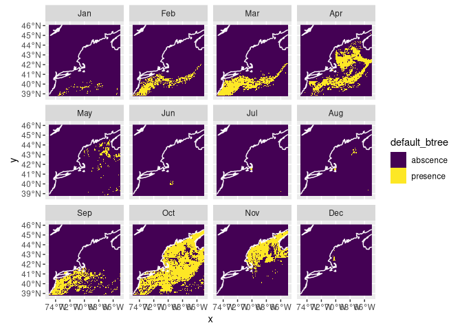
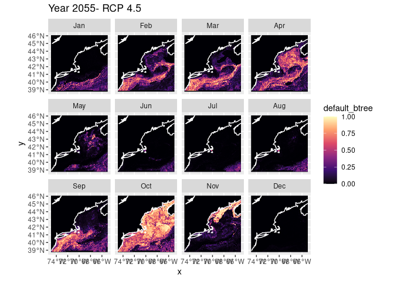
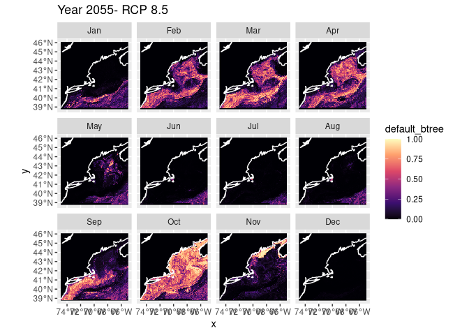
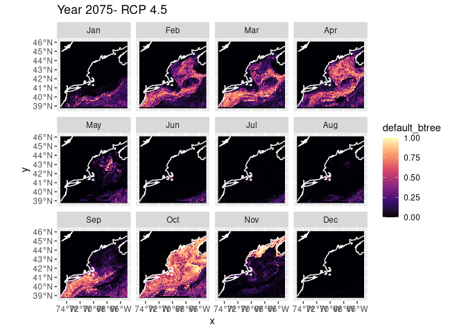
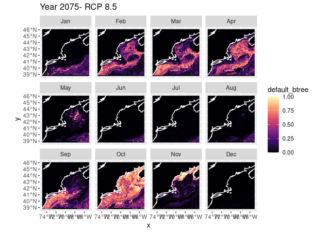

Predictions for My First Species
================

###### Zoe Ahmiegbe

## Introduction

For my first species, the longfin inshore squid, I will provide
predictions of its presence under different scenarios (RCP 4.5 and RCP
8.5) for the present, 2055 and 2075.

RCP 45: This is an intermediate scenario where effective action is taken
to reduce greenhouse gases, causing global emissions to peak around 2040
and then stabilize.

RCP 85: This is the “worst-case” scenario (often called “business as
usual”) where emissions continue to rise unchecked through the end of
the century because no significant climate action is taken.

### Nowcast: Present Time Period + Current Scenario

This section provides a nowcast (predictions about the present)
according to the current climate conditions.

I will load in my Brickman data first and then read in my model fits
from my previous exploration.

Now we can plot what is often called a “habitat suitability index” (hsi)
map. I’ll use the boosted tree model.

    ## numeric

<!-- -->

This is a presence/absence map with a threshold of 0.5, meaning that a
presence means the prediction was greater than 0.5. Using a higher
threshold would probably provide more accurate results.

<!-- -->

## Forecasting

### Year 2055

#### Year 2055 + Scenario RCP45

Let’s try forecasting under RCP45 conditions in 2055. First we load
those parameters, then run the prediction and plot.

Plotting the prediction for Year 2055 with scenario RCP45:

    ## numeric

<!-- -->

#### Year 2055 + Scenario RCP85

Let’s try forecasting under RCP85 conditions in 2055. First we load
those parameters, then run the prediction and plot.

    ## stars object with 3 dimensions and 4 attributes
    ## attribute(s):
    ##                         Min.      1st Qu.       Median         Mean
    ## default_glm     2.220446e-16 2.220446e-16 2.220446e-16 1.730603e-05
    ## default_rf      3.326638e-02 1.694092e-01 2.593423e-01 2.660109e-01
    ## default_btree   2.721378e-05 5.898789e-04 5.898789e-04 9.341310e-02
    ## default_maxent  1.108773e-02 1.898039e-01 4.453114e-01 4.774809e-01
    ##                      3rd Qu.       Max.  NA's
    ## default_glm     2.220446e-16 0.02042948 59796
    ## default_rf      3.627086e-01 0.70588869 59796
    ## default_btree   5.034502e-02 0.98957765     0
    ## default_maxent  7.490283e-01 0.99840288 59796
    ## dimension(s):
    ##       from  to offset    delta refsys point      values x/y
    ## x        1 121 -74.93  0.08226 WGS 84 FALSE        NULL [x]
    ## y        1  89  46.08 -0.08226 WGS 84 FALSE        NULL [y]
    ## month    1  12     NA       NA     NA    NA Jan,...,Dec

Plotting the prediction for Year 2055 with scenario RCP85:

    ## numeric

<!-- -->

### Year 2075 + Scenario RCP45

Predictions for year 2075 under RCP45 are presented here:

``` r
covars_rcp45_2075 = read_brickman(db |> filter(scenario == "RCP45", 
                                               year == 2075, 
                                               interval == "mon"),
                                  add = c("depth", "month")) |>
  select(all_of(cfg$keep_vars))
```

``` r
forecast_2075_RCP45 = predict_stars(model_fits, covars_rcp45_2075)
forecast_2075_RCP45
```

    ## stars object with 3 dimensions and 4 attributes
    ## attribute(s):
    ##                         Min.      1st Qu.       Median         Mean
    ## default_glm     2.220446e-16 2.220446e-16 2.220446e-16 1.827704e-05
    ## default_rf      2.830598e-02 1.656114e-01 2.526038e-01 2.649164e-01
    ## default_btree   3.007552e-05 5.898789e-04 5.898789e-04 9.234027e-02
    ## default_maxent  9.455429e-03 1.842047e-01 4.440784e-01 4.777623e-01
    ##                      3rd Qu.       Max.  NA's
    ## default_glm     2.220446e-16 0.02169416 59796
    ## default_rf      3.673145e-01 0.65766700 59796
    ## default_btree   4.280026e-02 0.99626273     0
    ## default_maxent  7.569825e-01 0.99842684 59796
    ## dimension(s):
    ##       from  to offset    delta refsys point      values x/y
    ## x        1 121 -74.93  0.08226 WGS 84 FALSE        NULL [x]
    ## y        1  89  46.08 -0.08226 WGS 84 FALSE        NULL [y]
    ## month    1  12     NA       NA     NA    NA Jan,...,Dec

``` r
plot_prediction(forecast_2075_RCP45['default_btree']) + ggtitle("Year 2075- RCP 4.5")
```

    ## numeric

<!-- -->

### Year 2075 + Scenario RCP85

Predictions for year 2075 under RCP85 are presented here:

``` r
covars_rcp85_2075 = read_brickman(db |> filter(scenario == "RCP85", 
                                               year == 2075, 
                                               interval == "mon"),
                                  add = c("depth", "month")) |>
  select(all_of(cfg$keep_vars))
```

``` r
forecast_2075_RCP85 = predict_stars(model_fits, covars_rcp45_2075)
forecast_2075_RCP85
```

    ## stars object with 3 dimensions and 4 attributes
    ## attribute(s):
    ##                         Min.      1st Qu.       Median         Mean
    ## default_glm     2.220446e-16 2.220446e-16 2.220446e-16 1.827704e-05
    ## default_rf      2.830598e-02 1.656114e-01 2.526038e-01 2.649164e-01
    ## default_btree   3.007552e-05 5.898789e-04 5.898789e-04 9.234027e-02
    ## default_maxent  9.455429e-03 1.842047e-01 4.440784e-01 4.777623e-01
    ##                      3rd Qu.       Max.  NA's
    ## default_glm     2.220446e-16 0.02169416 59796
    ## default_rf      3.673145e-01 0.65766700 59796
    ## default_btree   4.280026e-02 0.99626273     0
    ## default_maxent  7.569825e-01 0.99842684 59796
    ## dimension(s):
    ##       from  to offset    delta refsys point      values x/y
    ## x        1 121 -74.93  0.08226 WGS 84 FALSE        NULL [x]
    ## y        1  89  46.08 -0.08226 WGS 84 FALSE        NULL [y]
    ## month    1  12     NA       NA     NA    NA Jan,...,Dec

``` r
plot_prediction(forecast_2075_RCP85['default_btree']) + ggtitle("Year 2075- RCP 8.5")
```

    ## numeric

<!-- -->

## Saving the Predictions

It’s easy to save the predictions (and read then back with
`read_prediction()`).

``` r
# make sure the output directory exists
path = make_path("predictions")

write_prediction(nowcast,
                 scientificname = cfg$scientificname,
                 version = cfg$version,
                 year = "CURRENT",
                 scenario = "CURRENT")

# Year 2055
write_prediction(forecast_2055_RCP45,
                 scientificname = cfg$scientificname,
                 version = cfg$version,
                 year = "2075",
                 scenario = "RCP85")

write_prediction(forecast_2055_RCP85,
                 scientificname = cfg$scientificname,
                 version = cfg$version,
                 year = "2075",
                 scenario = "RCP85")

# Year 2075
write_prediction(forecast_2075_RCP45,
                 scientificname = cfg$scientificname,
                 version = cfg$version,
                 year = "2075",
                 scenario = "RCP85")

write_prediction(forecast_2075_RCP85,
                 scientificname = cfg$scientificname,
                 version = cfg$version,
                 year = "2075",
                 scenario = "RCP85")
```
