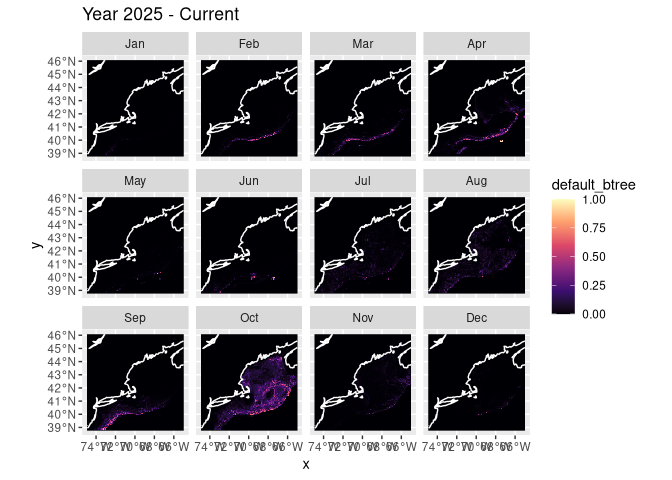
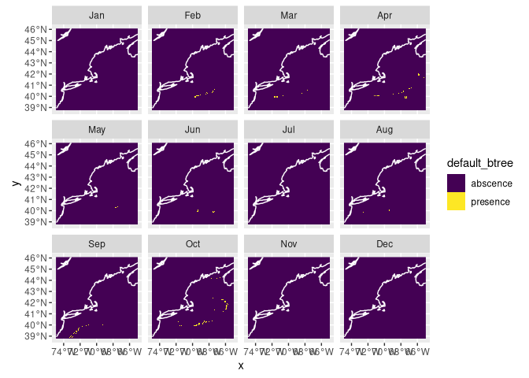
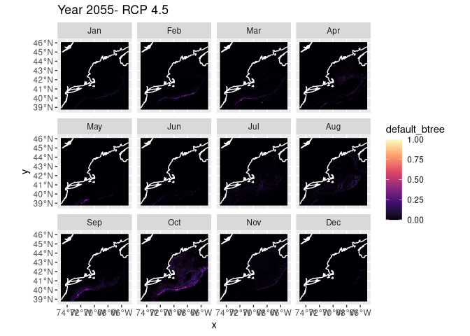

Predictions for My Second Species
================

###### Zoe Ahmiegbe

## Introduction

For my second species, the shortfin squid, I will provide predictions of
its presence under different scenarios (RCP 4.5 and RCP 8.5) for the
present, 2055 and 2075.

RCP 45: This is an intermediate scenario where effective action is taken
to reduce greenhouse gases.

RCP 85: This is the “worst-case” scenario (often called “business as
usual”) where emissions continue to rise unchecked through the end of
the century .

### Nowcast: Present Time Period + Current Scenario

This section provides a nowcast (predictions about the present)
according to the current climate conditions.

I will load in my Brickman data first and then read in my model fits
from my previous exploration.

Now we can plot what is often called a “habitat suitability index” (hsi)
map. We can

    ## numeric

<!-- -->

This is a presence/absence map with a threshold of 0.5, meaning that a
presence means the prediction was greater than 0.5. Using a higher
threshold would probably provide more accurate results.

<!-- -->

### Year 2055

#### Year 2055 + Scenario RCP45

Let’s try forecasting under RCP45 conditions in 2055. First we load
those parameters, then run the prediction and plot.

Plotting the prediction for Year 2055 with scenario RCP45:

    ## numeric

<!-- -->

#### Year 2055 + Scenario RCP85

Let’s try forecasting under RCP85 conditions in 2055. First we load
those parameters, then run the prediction and plot.

    ## stars object with 3 dimensions and 4 attributes
    ## attribute(s):
    ##                         Min.      1st Qu.       Median        Mean      3rd Qu.
    ## default_glm     9.999995e-01 1.0000000000 1.0000000000 1.000000000 1.0000000000
    ## default_rf      9.169307e-03 0.0780144856 0.1223475019 0.126628867 0.1720018927
    ## default_btree   2.276923e-06 0.0004669689 0.0004669689 0.003784177 0.0008361113
    ## default_maxent  2.814844e-07 0.0062882631 0.0239118611 0.067246076 0.0598787082
    ##                      Max.  NA's
    ## default_glm     1.0000000 59796
    ## default_rf      0.3615521 59796
    ## default_btree   0.6297603     0
    ## default_maxent  0.7612907 59796
    ## dimension(s):
    ##       from  to offset    delta refsys point      values x/y
    ## x        1 121 -74.93  0.08226 WGS 84 FALSE        NULL [x]
    ## y        1  89  46.08 -0.08226 WGS 84 FALSE        NULL [y]
    ## month    1  12     NA       NA     NA    NA Jan,...,Dec

Plotting the prediction for Year 2055 with scenario RCP85:

    ## numeric

<!-- -->

### Year 2075 + Scenario RCP45

Predictions for year 2075 under RCP45 are presented here:

    ## numeric

<!-- -->

### Year 2075 + Scenario RCP85

Predictions for year 2075 under RCP85 are presented here:

    ## numeric

<!-- -->

## Saving the Predictions

It’s easy to save the predictions (and read then back with
`read_prediction()`).

``` r
# make sure the output directory exists
path = make_path("predictions")

write_prediction(nowcast,
                 scientificname = cfg$scientificname,
                 version = cfg$version,
                 year = "CURRENT",
                 scenario = "CURRENT")

# Year 2055
write_prediction(forecast_2055_RCP45,
                 scientificname = cfg$scientificname,
                 version = cfg$version,
                 year = "2055",
                 scenario = "RCP45")

write_prediction(forecast_2055_RCP85,
                 scientificname = cfg$scientificname,
                 version = cfg$version,
                 year = "2055",
                 scenario = "RCP85")

# Year 2075
write_prediction(forecast_2075_RCP45,
                 scientificname = cfg$scientificname,
                 version = cfg$version,
                 year = "2075",
                 scenario = "RCP45")

write_prediction(forecast_2075_RCP85,
                 scientificname = cfg$scientificname,
                 version = cfg$version,
                 year = "2075",
                 scenario = "RCP85")
```
