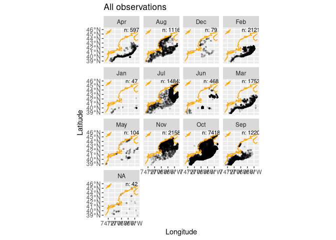
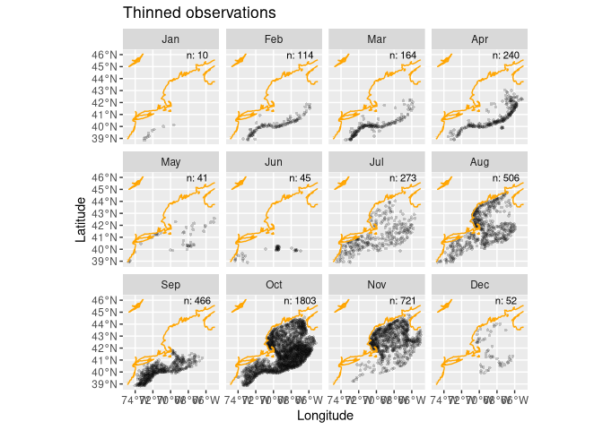
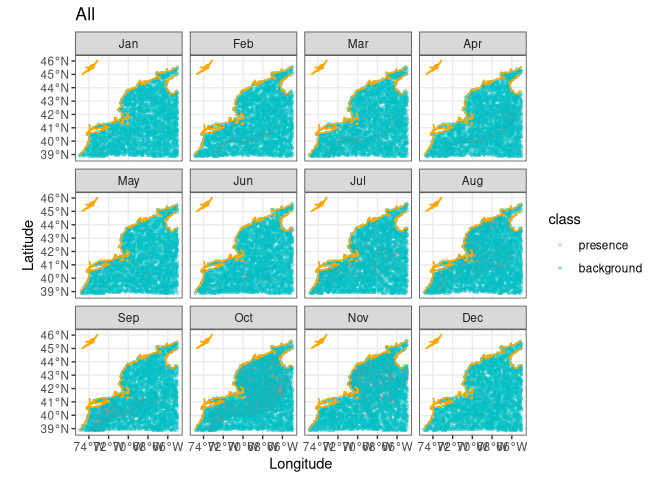
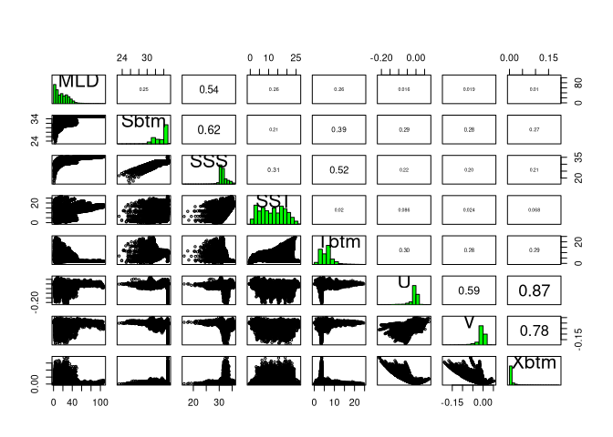
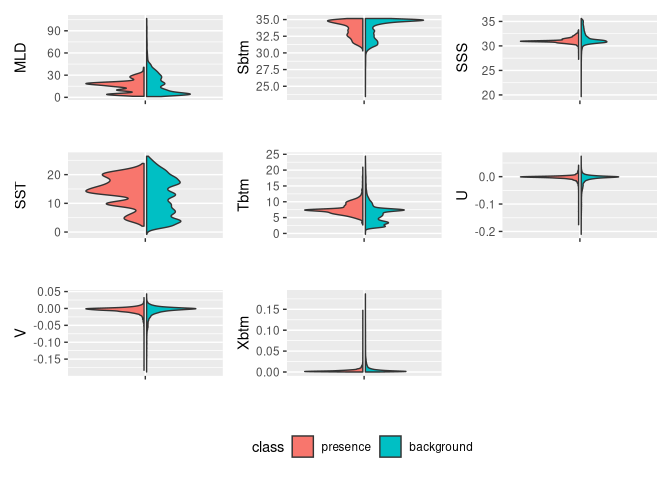

My Second Species
================

###### Zoe Ahmiegbe

## Picking My Second Species

I picked the short fin squid *Illex illecebrosus* as a complementary
species to the longfin squid.

### Steps

*Setup* : I will retrieve its data sets from OBIS and provide a summary.

#### Reading in the Covariates

I’ll read in the Brickman database, then filter two different subsets to
read.

<!-- -->

I have 31,996 records for the shortfin squid before filtering the OBIS
data set.

To investigate where these observations came from, I will run the
basisOfRecord function. At a glance, I can see that most observations
are made by humans!

#### Filtering the Observations

I will filter my data to get rid of occurences where eventDate is NA, or
the data is earlier than my minimum year. I also modified my
read_observations function so the user has more control when deciding
which NA’s to remove (drop_na).

``` r
obs <- read_observations(
  scientificname = "Illex illecebrosus",
  minimum_year = 1960,
  drop_na = c("individualCount", "eventDate")
)
```

After filtering, I have 7,100 records left which is a stark difference
compared to the original set of about 30,000 records.

#### Reading Model Input

I have prepared a model input for “Illex illecebrosus”, by thinning
observations and selecting background points. I thinned the data so that
some areas didn’t have way more observations than others. This helps
prevent biased results caused by sampling the same locations too often.

#### Thinning Observations

After thinning my observations, my observation map now looks like this:

<!-- -->

#### Random Sampling

Following Instructor Ben’s advice (thank you!), I used random background
sampling because the observations were well-spaced and survey effort
consistent, making a bias map unnecessary. My understanding is that the
bias map could misinterpret the actual spatial distribution of the
observations.

``` r
obsbkg = sapply(month.abb,
    function(mon){ 
      sample_background(thinned_obs |> filter(month == mon), # <- just this month
                       mask,
                       method = "random",  
                       return_pres = TRUE, # <-- give me the obs back, too
                       n = nback_avg) |>   # <-- how many points
        mutate(month = mon, .before = 1)
    }, simplify = FALSE) |>
  bind_rows() |>
  mutate(month = factor(month, levels = month.abb))
#obsbkg 
```

<!-- -->

#### A `pairs` plot

It reveals the relationships among the variables pair-by-pair.

<!-- -->

I set my cutoff mark for the filter_collinear to 0.90 so I could keep
all variables.

#### Extracting Data Variables from Covariates

###### Comparing Variables for Presence and Background

The plot below shows the comparison between the variables for each
class: presence and background.  
<!-- -->

#### Let’s Make a Configuration File

I made a configuration file that stores the version identifier, species
name, the background selection scheme and the names of the variables to
model with. Configuration files are simply a useful way to store
information about the choices we make! For my second species (Illex
illecebrosus), its configuration file can be found in my models folder.

Thank you!
